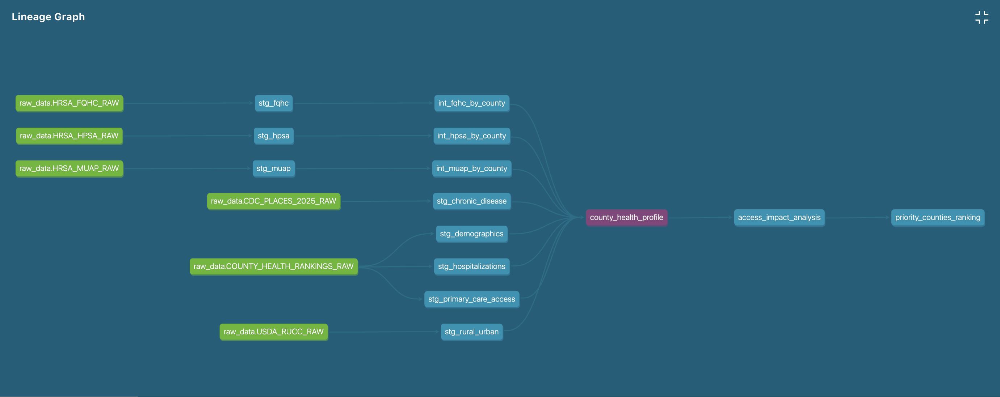
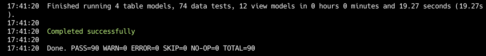
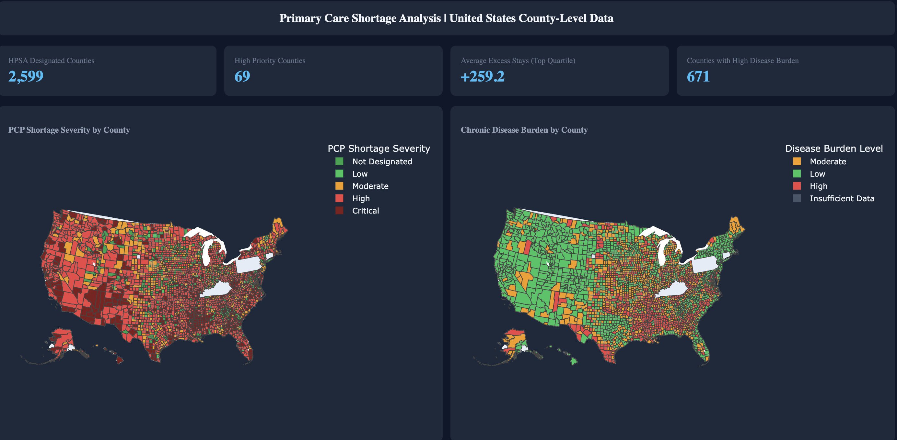

# Project Overview

## Primary Care Shortage Analysis

**Beyond Access: A Multi-Source Analysis of Primary Care Shortages, Chronic Disease Burden, and Preventable Hospitalizations Across US Counties**

## Overview

A multi-source data analytics project — encompassing ELT pipeline, data warehouse, and
interactive dashboard — examining how primary care shortages correlate with
chronic disease burden and preventable hospitalizations across 3,144 US counties using
Snowflake, dbt, SQL, and Plotly.

**Problem Statement:** Over 92 million Americans live in designated primary care Health
Professional Shortage Areas (HPSAs) — a number that grew 21% in 2025 alone — yet the
downstream health consequences of these shortages remain poorly quantified at the county
level. This project investigates whether primary care shortages are associated with higher chronic
disease prevalence and preventable hospitalization rates, and identifies which counties
face the compounding burden of shortage, high disease burden, and inadequate safety net
coverage.

## Research Questions

- Do primary care HPSA counties have higher rates of multiple chronic diseases?
- What is the relationship between primary care shortages and preventable hospitalization rates in HPSA-designated counties?
- Which counties have the combination of primary care shortage, high disease prevalence, and preventable hospitalizations?
- Do counties with higher FQHC density show lower preventable hospitalization rates?
- What is the geographic distribution of counties with coinciding primary care shortages and high chronic disease burden?

## Methodology

Data from 6 sources was ingested into Snowflake and transformed using a dbt pipeline
with staging, intermediate, and mart layers. County-level metrics were joined on FIPS
codes to create a unified analytical dataset covering 2,957 US counties.

**SQL Analysis** — queries were drafted in VSCode in the `/analyses` folder and executed
in Snowflake to answer each research question, including...

- Chronic disease prevalence comparisons between HPSA and non-HPSA counties
- Pearson correlation and quartile analysis of shortage severity vs hospitalization rates
- Triple burden county identification (shortage + high disease + excess hospitalizations)
- FQHC effectiveness by shortage status (categorical group comparison)
- Predictors of preventable hospitalizations (disease burden, PCP ratio, poverty, race, rurality)
- Geographic distribution of shortage + high disease burden counties by state

**Data Export & Visualization** — analytical outputs were exported as CSV to
`data-processed/` for use in the Plotly dashboard:

- `county_health_profile.csv`
- `access_impact_analysis.csv`
- `priority_counties_ranking.csv`
- `regional_patterns.csv`

Dashboard layout was planned in [Figma](https://www.figma.com/design/W51QZYKUW8KN1E2wpoLOE4/Primary-Care-Shortage-Dashboard?node-id=0-1&t=LQVn5JJzD6nr7jeb-1)
before development and built using Plotly Dash with a custom dark theme color palette.

> **Note:** Final dataset covers 2,957 of 3,144 US counties. Approximately 186 counties
> were excluded due to missing data in one or more source files during the join process.

## Key Insights

- **HPSA counties show consistently higher chronic disease burden** across all 11
  conditions analyzed, with hypertension showing the largest gap (+2.29 percentage points higher vs non-HPSA).

- **FQHCs alone are insufficient to offset hospitalization burden** they may be treating the sickest counties but can't fully compensate for systemic PCP gaps.

- **The shortage itself may be contributing to worse chronic disease management over time** PCP shortages correlate more strongly with chronic disease than hospitalizations (diabetes r=0.38 vs hospitalization r=0.18), suggesting shortages drive worse disease management over time.

- **Triple burden counties are concentrated in the rural South and Appalachia** — top
  priority counties span VA, AL, GA, MS, IL, NE, IN, AR, OK, SD, LA, ND, TX, MO, KS; 69 classified as high priority (Tier 2), 8 out of 10 are dual-designated (HPSA + MUA/P).

- **Scale of the problem is significant** — 2,599 HPSA-designated counties, 671 counties
  with high disease burden, and counties in the highest shortage quartile average 272+
  excess preventable stays above the national average. St. Louis, MO alone has an estimated
  3,379 preventable admissions annually.

## Data Sources

- CDC PLACES
  - Source: Centers for Disease Control and Prevention (CDC)
  - Download: https://data.cdc.gov/500-Cities-Places/PLACES-Local-Data-for-Better-Health-County-Data-20/swc5-untb/about_data
  - Release: 2025
  - Geo: County-level
  - Main metrics: Chronic disease burden, pre/post COVID
  - Key measures: 12 health outcomes (arthritis, asthma, high blood pressure, cancer, high cholesterol, chronic kidney disease, chronic obstructive pulmonary disease, coronary heart disease, depression, diabetes, obesity, stroke), 7 preventive services, 4 health risk behaviors, 7 disabilities, 3 health status measures, 7 health-related social needs

- HRSA Health Professional Shortage Areas (HPSA)
  - Source: Health Resources & Services Administration (HRSA)
  - Download: https://data.hrsa.gov/data/download
  - Data Dictionary: See `data-raw/hrsa/HPSA_DATAMART_METADATA.XLSX`
  - Geo: County-level
  - Main metrics: Shortage designations
  - Key measures: HPSA Status, HPSA Score, HPSA Discipline Class, Rural Status, HPSA Formal Ratio, HPSA Shortage, HPSA Estimated Underserved Population

- HRSA Medically Underserved Areas/Populations (MUA/P)
  - Source: Health Resources & Services Administration (HRSA)
  - Download: https://data.hrsa.gov/data/download
  - Geo: County-level
  - Main metrics: Overall medical underservice
  - Key measures: MUA/P Status Description, Designation Type, IMU Score, Population Type, Rural Status Description
  - Useful measures: Percent of Population with Income at or Below 100% Poverty, Percentage of Population Age 65 and Over, Infant Mortality Rate, Providers per 1000 Population, Designation Population

- HRSA Health Center Service Delivery and Look-Alike Sites (FQHCs)
  - Source: Health Resources & Services Administration (HRSA)
  - Download: https://data.hrsa.gov/data/download
  - Data Dictionary: See `data-raw/hrsa/Health_Center_Service_Delivery_and_LookAlike_Sites_Data_Download_Metadata.xlsx`
  - Geo: Site-level (address), aggregated to county
  - Main metrics: FQHC locations
  - Key measures: Health Center Type, Site Status Description, Operating Hours per Week, Geocoding Artifact Address Primary X/Y Coordinate

- County Health Rankings & Roadmaps (CHR)
  - Source: University of Wisconsin Population Health Institute
  - Download: https://www.countyhealthrankings.org/health-data/methodology-and-sources/data-documentation
  - Release: 2025
  - Data Dictionary: See `data-raw/county-health-rankings/DataDictionary_2025.pdf`
  - Geo: County-level
  - Main metrics: PCPs per capita, preventable hospitalizations, Insurance coverage, income inequality, poverty rate, population demographics
  - Key measures: Primary Care Physicians raw value, Ratio of population to primary care physicians, Other Primary Care Providers raw value, Ratio of population to primary care providers other than physicians, Preventable Hospital Stays raw value, Uninsured raw value, Income Inequality raw value, Children in Poverty raw value, Median Household Income raw value
  - Useful measures: Preventable Hospital Stays with breakdowns by race (AIAN, Asian/Pacific Islander, Black, Hispanic, White), Life Expectancy raw value, % Rural raw value, Population raw value, % Non-Hispanic Black raw value, % Hispanic raw value

- USDA Rural-Urban Continuum Codes (RUCC)
  - Source: USDA Economic Research Service (ERS)
  - Download: https://www.ers.usda.gov/data-products/rural-urban-continuum-codes
  - Release: 2023
  - Geo: County-level
  - Main metrics: Rural/urban classification
  - Key measures: Attribute, Value -> RUCC_2023 (rural-urban continuum code (1-9 scale)), description (text description of rural/urban category), Population_20 (population)

- US County Boundaries (GeoJSON)
  - Source: Plotly Datasets (via GitHub)
  - Download: https://raw.githubusercontent.com/plotly/datasets/master/geojson-counties-fips.json
  - Geo: County-level
  - Main metrics: Geographic boundaries for choropleth mapping
  - Key measures: County FIPS codes, polygon boundaries

## Data Dictionary

### county_health_profile.csv

Primary analytical dataset with health, demographic, and access metrics for all 2,957 US counties.

| Column                   | Description                                                                       | Type    |
| ------------------------ | --------------------------------------------------------------------------------- | ------- |
| COUNTY_FIPS              | 5-digit Federal Information Processing Standards county code (primary key)        | string  |
| COUNTY_NAME              | County name                                                                       | string  |
| STATE_ABBR               | Two-letter state abbreviation                                                     | string  |
| TOTAL_POPULATION         | Total county population                                                           | integer |
| DISEASE_BURDEN_LEVEL     | Chronic disease burden classification (Low / Moderate / High / Insufficient Data) | string  |
| DISEASE_COUNT            | Number of chronic conditions with above-average prevalence                        | integer |
| DIABETES_PCT             | % of adults with diabetes                                                         | float   |
| HYPERTENSION_PCT         | % of adults with high blood pressure                                              | float   |
| HEART_DISEASE_PCT        | % of adults with coronary heart disease                                           | float   |
| COPD_PCT                 | % of adults with COPD                                                             | float   |
| OBESITY_PCT              | % of adults with obesity                                                          | float   |
| PCP_PER_100K             | Primary care physicians per 100,000 population                                    | float   |
| IS_HPSA_DESIGNATED       | 1 if county is a Health Professional Shortage Area                                | integer |
| HPSA_SCORE               | HPSA severity score (0-25, higher = more severe shortage)                         | integer |
| HPSA_SEVERITY_TIER       | Categorical shortage tier (No Shortage / Low / Moderate / High / Critical)        | string  |
| IS_MEDICALLY_UNDERSERVED | 1 if county is a Medically Underserved Area/Population                            | integer |
| IS_DUAL_DESIGNATED       | 1 if county has both HPSA and MUA/P designation                                   | integer |
| HAS_FQHC                 | 1 if county has at least one Federally Qualified Health Center                    | integer |
| FQHC_SITE_COUNT          | Number of FQHC sites in county                                                    | integer |
| EXCESS_PREVENTABLE_STAYS | Avg preventable hospital stays above/below national average                       | float   |
| ABOVE_NATIONAL_AVG_HOSP  | 1 if county exceeds national average preventable hospitalizations                 | integer |
| URBAN_RURAL_CATEGORY     | Rural/urban classification (Metro / Micropolitan / Rural)                         | string  |
| UNINSURED_PCT            | % of population without health insurance                                          | float   |
| CHILDREN_IN_POVERTY_PCT  | % of children living in poverty                                                   | float   |
| MEDIAN_HOUSEHOLD_INCOME  | Median household income in USD                                                    | float   |

---

### access_impact_analysis.csv

Focused dataset for analyzing access barriers and hospitalization outcomes, with derived grouping variables.

| Column                  | Description                                                                            | Type    |
| ----------------------- | -------------------------------------------------------------------------------------- | ------- |
| SHORTAGE_GROUP          | Shortage + FQHC combination category                                                   | string  |
| FQHC_ACCESS_GROUP       | FQHC access classification                                                             | string  |
| HIGH_BURDEN_LOW_ACCESS  | 1 if county has high disease burden and low PCP access                                 | integer |
| HAS_RACIAL_DISPARITY    | 1 if county has significant Black-White or Hispanic-White hospitalization gap          | integer |
| VULNERABILITY_SCORE     | Composite score (0-5) combining shortage, disease burden, and outcome measures         | integer |
| BLACK_WHITE_HOSP_GAP    | Difference in preventable hospitalization rates between Black and White populations    | float   |
| HISPANIC_WHITE_HOSP_GAP | Difference in preventable hospitalization rates between Hispanic and White populations | float   |

---

### priority_counties_ranking.csv

County-level priority ranking dataset for targeting intervention resources.

| Column                 | Description                                               | Type    |
| ---------------------- | --------------------------------------------------------- | ------- |
| PRIORITY_RANK          | National priority rank (1 = highest need)                 | integer |
| PRIORITY_RANK_IN_STATE | Priority rank within state                                | integer |
| PRIORITY_SCORE         | Composite priority score across all dimensions            | float   |
| SHORTAGE_SCORE         | Sub-score for PCP shortage severity                       | float   |
| DISEASE_SCORE          | Sub-score for chronic disease burden                      | float   |
| OUTCOME_SCORE          | Sub-score for preventable hospitalization outcomes        | float   |
| INTERVENTION_TIER      | Priority tier for intervention (Tier 1 / Tier 2 / Tier 3) | string  |
| ADMISSIONS_PREVENTABLE | Estimated number of preventable admissions                | float   |

---

### regional_patterns.csv

State-level aggregation summary for county-level shortage and health outcome metrics.

| Column                   | Description                                             | Type    |
| ------------------------ | ------------------------------------------------------- | ------- |
| STATE_ABBR               | Two-letter state abbreviation                           | string  |
| TOTAL_COUNTIES           | Total number of counties in state                       | integer |
| HPSA_COUNTIES            | Number of HPSA-designated counties                      | integer |
| MUAP_COUNTIES            | Number of MUA/P-designated counties                     | integer |
| DUAL_DESIGNATED_COUNTIES | Number of counties with both HPSA and MUA/P designation | integer |
| AVG_EXCESS_STAYS         | Average excess preventable stays across counties        | float   |
| AVG_PRIORITY_SCORE       | Average county priority score                           | float   |
| AVG_PCP_PER_100K         | Average PCPs per 100,000 population                     | float   |
| AVG_UNINSURED_PCT        | Average uninsured rate                                  | float   |
| AVG_POVERTY_PCT          | Average poverty rate                                    | float   |
| HIGH_BURDEN_COUNTIES     | Number of counties with high chronic disease burden     | integer |

## Running dbt Models





### Prerequisites

- Python 3.8+
- Snowflake account with access to `PCP_SHORTAGE_ANALYTICS` database
- dbt Core installed (`pip install dbt-snowflake`)

### Setup

1. Clone the repository

```bash
   git clone https://github.com/alinix1/primary-care-shortage-analysis.git
   cd primary-care-shortage-analysis/healthcare_disparities_analytics
```

2. Configure your dbt profile in `~/.dbt/profiles.yml`

```yaml
healthcare_disparities_analytics:
  target: dev
  outputs:
    dev:
      type: snowflake
      account: your_account
      user: your_username
      password: your_password
      role: your_role
      database: PCP_SHORTAGE_ANALYTICS
      warehouse: COMPUTE_WH
      schema: DEV
```

3. Install dbt dependencies

```bash
   dbt deps
```

### Running the Models

```bash
# Run all models
dbt run

# Run a specific layer
dbt run --select staging
dbt run --select intermediate
dbt run --select marts

# Test the models
dbt test

# Generate and serve documentation
dbt docs generate
dbt docs serve
```

### Model Architecture

- **staging/** → raw source cleaning and standardization (materialized as views)
- **intermediate/** → joins and transformations across sources (materialized as views)
- **marts/** → final analytical tables for analysis and dashboard (materialized as tables)

## Setup & Installation

### Python Environment

```bash
# Create virtual environment
python -m venv venv
source venv/bin/activate  # Mac/Linux
venv\Scripts\activate     # Windows

# Install dependencies
pip install -r requirements.txt

# Deactivate when done
deactivate
```

### Running the Dashboard

```bash
cd plotly-dashboard
python dashboard.py
```

Then open `http://127.0.0.1:8050` in your browser.

## Technologies


## Timeline

- **Week 1:** Project setup, Snowflake configuration, data acquisition
- **Week 2:** dbt models (staging, intermediate, and marts)
- **Week 3:** SQL analysis, interactive dashboard visualization development
- **Week 4:** Documentation, portfolio preparation

## Deliverables



- **dbt pipeline** with staging, intermediate, and marts layers transforming 6 raw data sources into analytical datasets
- **4 processed datasets** exported as CSV for reproducibility (`county_health_profile`, `access_impact_analysis`, `priority_counties_ranking`, `regional_patterns`)
- **Interactive Plotly dashboard** with choropleth maps, bar charts, scatter plots, table, and heat map visualizing shortage severity, disease burden, and preventable hospitalizations
- **Jupyter notebook** with full end-to-end analysis workflow including SQL queries, statistical correlations, and key findings

## Roadmap

- **Pre/post COVID trend analysis** — compare chronic disease prevalence between 2021 and 2025 releases
- **Regional patterns dashboard integration** — incorporate state-level summary data into the Plotly dashboard
- **Multivariate regression or logistic regression analysis** — to model excess preventable stays across multiple predictors simultaneously and quantify independent contributions

## Author

Ali Nix | MPH Biostatistics | Aspiring Data Analyst | [![LinkedIn][linkedin-shield]][linkedin-url1]

<!-- MARKDOWN LINKS & IMAGES -->

[linkedin-shield]: https://img.shields.io/badge/-LinkedIn-black.svg?style=for-the-badge&logo=linkedin&colorB=555
[linkedin-url1]: https://www.linkedin.com/in/ali-nix-38b9b9126/
